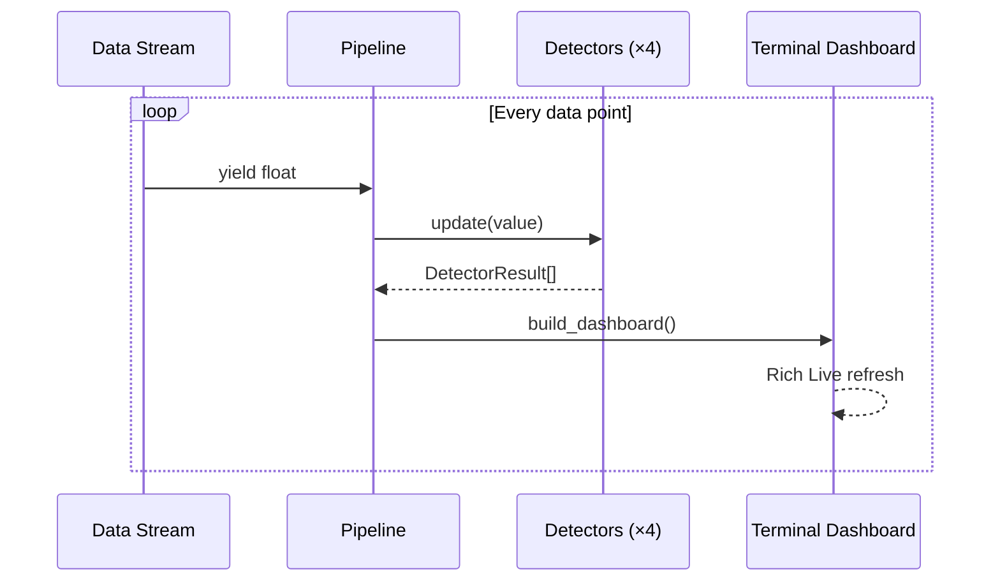

# 🔬 driftglass

> **A local-first data pipeline anomaly detector — watches data streams for concept drift, distribution shifts, and statistical anomalies in real-time from your terminal.**

*Scheduled and created by [hellohaven.ai](https://hellohaven.ai)*

---

## Why driftglass?

ML models silently rot. Data pipelines break in subtle ways — a feature's mean creeps upward, variance explodes, or a distribution quietly shifts. By the time dashboards turn red, damage is done.

**driftglass** brings four battle-tested statistical detectors into a single, beautiful terminal UI. Point it at a data stream and watch it light up the moment something goes wrong — no cloud, no infra, no dashboards. Just your terminal.

## Features

- 🧪 **4 statistical detectors** running in parallel: Page-Hinkley, ADWIN-lite, Z-Score Spike, KL Divergence
- 📊 **Live terminal dashboard** powered by Rich — sparklines, color-coded severity, real-time stats
- 🎲 **5 built-in data scenarios**: stable, gradual drift, sudden shift, periodic w/ spikes, variance explosion
- 📋 **Static report mode** for batch analysis
- 🔌 **Clean pipeline API** — easily plug your own data sources
- ⚡ **Zero external services** — runs entirely local, pure Python

## Architecture

```mermaid
flowchart TB
    subgraph Input["Data Sources"]
        G1[Stable Gaussian]
        G2[Gradual Drift]
        G3[Sudden Shift]
        G4[Periodic + Spikes]
        G5[Variance Explosion]
        CUSTOM[Your Data Source]
    end

    subgraph Pipeline["Detection Pipeline"]
        PH[Page-Hinkley\nChange-Point]
        AW[ADWIN-lite\nTwo-Window t-test]
        ZS[Z-Score\nSpike Detector]
        KL[KL Divergence\nDistribution Shift]
    end

    subgraph Output["Output"]
        DASH[Rich Live Dashboard]
        RPT[Static Report Table]
    end

    Input --> |float stream| Pipeline
    Pipeline --> |DetectorResult[]| Output
```

## How It Works

Each data point flows through all four detectors simultaneously:

| Detector | What It Catches | Method |
|---|---|---|
| **Page-Hinkley** | Abrupt mean changes | Cumulative sum test |
| **ADWIN-lite** | Distribution shifts | Two-window Welch's t-test |
| **Z-Score Spike** | Outliers / anomalies | Rolling z-score |
| **KL Divergence** | Shape changes | Histogram-based KL divergence |

Each detector returns a `DetectorResult` with severity (`ok`, `warning`, `drift`), the computed statistic, the threshold, and a human-readable message.



## Setup

```bash
# Clone the repo
git clone https://github.com/DucChau/driftglass.git
cd driftglass

# Create a virtual environment
python -m venv .venv
source .venv/bin/activate  # or .venv\Scripts\activate on Windows

# Install in editable mode
pip install -e ".[dev]"
```

## Usage

### Live simulation (interactive)

```bash
# Run with gradual drift scenario (default)
driftglass run

# Pick a scenario
driftglass run --scenario sudden --steps 800

# Slow it down to watch
driftglass run --scenario periodic-spikes --delay 0.1

# Reproducible run
driftglass run --scenario variance-explosion --seed 42
```

### Static report

```bash
driftglass report --scenario sudden --steps 1000

# Output: a table of all detected drift/warning events
```

### List scenarios

```bash
driftglass list-scenarios
```

### Using the Pipeline API programmatically

```python
from driftglass.pipeline import Pipeline
from driftglass.generators import sudden_shift

pipe = Pipeline()
stream = sudden_shift(shift_at=200)

for i, value, results in pipe.feed_stream(stream):
    if i > 500:
        break
    for r in results:
        if r.severity.value != "ok":
            print(f"[{i}] {r.metric_name}: {r.message}")
```

## Running Tests

```bash
pytest tests/ -v
```

## Project Structure

```
driftglass/
├── driftglass/
│   ├── __init__.py          # Package metadata
│   ├── cli.py               # Click CLI entrypoint
│   ├── detectors.py         # Four statistical detectors
│   ├── display.py           # Rich terminal dashboard
│   ├── generators.py        # Synthetic data scenarios
│   └── pipeline.py          # Orchestration layer
├── tests/
│   ├── __init__.py
│   ├── test_detectors.py    # Detector unit tests
│   └── test_pipeline.py     # Pipeline integration tests
├── pyproject.toml           # Build config & dependencies
├── LICENSE                  # MIT
└── README.md                # You are here
```

## Future Improvements

- 📁 CSV/JSON file input mode — point at a column and detect drift
- 🌐 HTTP webhook alerts when drift is detected
- 📈 Matplotlib/Plotly export for post-hoc visualization
- 🧠 Ensemble voting — combine detector signals into a single confidence score
- 🔧 YAML config for detector thresholds and pipeline composition
- 🐳 Docker container for monitoring a live data feed

## License

MIT — see [LICENSE](LICENSE).

---

*Built with 🔬 by [hellohaven.ai](https://hellohaven.ai)*
